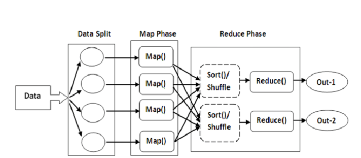

# HANKERRANK - MAPREDUCE


[](https://medium.com/@yennhi95zz/subscribe)
[](https://github.com/yennhi95zz)
[](https://www.kaggle.com/nhiyen/code)
[](https://www.linkedin.com/in/yennhi95zz/)


## I. What is MapReduce?

MapReduce is a programming model and processing technique designed for processing and generating large datasets in a parallel and distributed manner. It was introduced by Google to handle the vast amounts of data that their search engine and other services needed to process efficiently. The concept was later popularized by the open-source Apache Hadoop project.

In a MapReduce framework, the processing is divided into two main phases:



### 1. Map Phase:

- The input data is divided into smaller chunks, and a "`mapper`" function is applied to each chunk independently.
- The mapper function takes the input data and produces a set of key-value pairs (intermediate data).

### 2. Reduce Phase:

- The intermediate data generated by the mappers is shuffled and grouped based on keys.
- A "`reducer`" function is applied to each group of intermediate data, combining and aggregating the results to produce the final output.

The key characteristics of MapReduce are fault tolerance and scalability. The framework automatically handles failures of individual nodes in a distributed computing environment, and it can scale horizontally by adding more nodes to the cluster.

`Hadoop`, an open-source implementation of MapReduce, is widely used in big data processing. However, it's important to note that while MapReduce has been a foundational concept, newer big data processing frameworks like Apache Spark have gained popularity due to their improved performance and ease of use.


## II. Quiz

### Question 1: Map Reduce Advanced - Count number of friends
**Mappers and Reducers**

Here's a quick but comprehensive introduction to the idea of splitting tasks into a MapReduce model. The four important functions involved are:

```
Map (the mapper function)  
EmitIntermediate(the intermediate key,value pairs emitted by the mapper functions)  
Reduce (the reducer function)  
Emit (the final output, after summarization from the Reduce functions)
```

We provide you with a single system, single thread version of a basic MapReduce implementation.

**Task**

Joins are

The input is a number of lines with pairs of name of friends, in the form:

```
[Friend1] [Friend2]
```

The required output is to print the number of friends of each person, in the format shown. The code for the MapReduce class, parts related to IO etc. has already been provided. However, the mapper and reducer functions are incomplete. Your task is to fill up the mapper and reducer functions appropriately, such that the program works, and outputs the list of number of friends of each person , in lexicographical order.

Also, this program outputs certain information to the error stream. This information has been logged to help beginners gain a better understanding of the the intermediate steps in a map-reduce process.

**Languages Supported**

Currently, we provide the base code in Python.

**Input Format**

A list of single space separated pairs of friend names. We have already written the input handling code to read in this data.

**Output Format**

Again, the output handling part has already been provided in the template code. The Key contains [Person name] and the value contains the number of friends, sorted in lexicographical order. The entities in this list, will naturally be confined to only those people provided in the input data.

**Sample Input**
```
Joe Sue
Sue Phi
Phi Joe
Phi Alice
```
**Sample Output**
```
{"key":"Alice","value":"1"}
{"key":"Joe","value":"2"}
{"key":"Phi","value":"3"}
{"key":"Sue","value":"2"}
```
**Explanation**

We have computed the number of friends for each person via the Mapper and Reducer functions.

**Code**

```
import sys
from collections import OrderedDict
class MapReduce:
    def __init__(self):
        self.intermediate = OrderedDict()
        self.result = []
   

    def emitIntermediate(self, key, value):
   	self.intermediate.setdefault(key, [])       
        self.intermediate[key].append(value)

    def emit(self, value):
        self.result.append(value) 

    def execute(self, data, mapper, reducer):
        for record in data:
            mapper(record)

        for key in self.intermediate:
            reducer(key, self.intermediate[key])

        self.result.sort()
        for item in self.result:
            print "{\"key\":\""+item[0]+"\",\"value\":\"" + str(item[1]) + "\"}"

mapReducer = MapReduce()

def mapper(record):
    #Start writing the Map code here

def reducer(key, list_of_values):
    #Start writing the Reduce code here

if __name__ == '__main__':
  inputData = []
  for line in sys.stdin:
   inputData.append(line)
  mapReducer.execute(inputData, mapper, reducer)
```

**ANSWER:** 

Check out the solution in this [Python file](question1-count-number-of-friends.py). To run the code, use the following command in your terminal:
```
python question1-count-number-of-friends.py < question1-input
```


### Question 2: Map Reduce Advanced - Relational Join

**Mappers and Reducers**

Here's a quick but comprehensive introduction to the idea of splitting tasks into a MapReduce model. The four important functions involved are:

```
Map (the mapper function)  
EmitIntermediate(the intermediate key,value pairs emitted by the mapper functions)  
Reduce (the reducer function)  
Emit (the final output, after summarization from the Reduce functions)
```
We provide you with a single system, single thread version of a basic MapReduce implementation.

**Task**

A SQL join combines records from two or more tables in a relational database. It creates a set that can be saved as a table or used as it is. A JOIN is a means for combining fields from two tables (or more) by using values common to each.

The input is a number of lines with records from two tables Employee and Department. A tuple from Employee table will look like:
```
Employee [Person_Name] [SSN]
```
A tuple from Department table will look like:
```
Department [SSN] [Department_Name]
```
The required output is to print the JOIN of the two tables Employee and Department, in the format shown. The code for the MapReduce class, parts related to IO etc. has already been provided. However, the mapper and reducer functions are incomplete. Your task is to fill up the mapper and reducer functions appropriately, such that the program works, and outputs the JOIN of the two tables, in lexicographical order.

Also, this program outputs certain information to the error stream. This information has been logged to help beginners gain a better understanding of the the intermediate steps in a map-reduce process.

**Languages Supported**

Currently, we provide the base code in Python.

**Input Format**

A list of comma separated records from the tables Employee and Department. We have already written the input handling code to read in this data.

**Output Format**

Again, the output handling part has already been provided in the template code. The output contains the JOINed records in the following format arranged lexicographically -
```
([SSN] [Employee_Name] [Department_Name])
```
**Sample Input**
```
Department,1234,Sales
Employee,Susan,1234
Department,1233,Marketing
Employee,Joe,1233
Department,1233,Accounts
```
**Sample Output**
```
('1233', 'Joe', 'Accounts')
('1233', 'Joe', 'Marketing')
('1234', 'Susan', 'Sales')
```
**Explanation**

We have computed the JOIN of two tables Employee and Department via the Mapper and Reducer functions.

**Code**
```
import sys
from collections import OrderedDict
class MapReduce:
    def __init__(self):
        self.intermediate = OrderedDict()
        self.result = []
   

    def emitIntermediate(self, key, value):
   	self.intermediate.setdefault(key, [])       
        self.intermediate[key].append(value)

    def emit(self, value):
        self.result.append(value) 

    def execute(self, data, mapper, reducer):
        for record in data:
            mapper(record)

        for key in self.intermediate:
            reducer(key, self.intermediate[key])

        self.result.sort()
        for item in self.result:
            print item

mapReducer = MapReduce()

def mapper(record):
    #Start writing the Map code here

def reducer(key, list_of_values):
    #Start writing the Reduce code here

if __name__ == '__main__':
  inputData = []
  for line in sys.stdin:
   inputData.append(line)
  mapReducer.execute(inputData, mapper, reducer)
```

**ANSWER:** 

Check out the solution in this [Python file](question2-relational-join.py). To run the code, use the following command in your terminal:
```
python question2-relational-join.py < question2-input
```

### Question 3: Matrix Multiplication

**Mappers and Reducers**

Here's a quick but comprehensive introduction to the idea of splitting tasks into a MapReduce model. The four important functions involved are:

```
Map (the mapper function)  
EmitIntermediate(the intermediate key,value pairs emitted by the mapper functions)  
Reduce (the reducer function)  
Emit (the final output, after summarization from the Reduce functions)
```
We provide you with a single system, single thread version of a basic MapReduce implementation.

**Task**

The input is a number of test cases with two matrices each. A single test case will look like:
```
[#Rows_Matrix_1] [#Columns_Matrix_1]
[Row_1_Matrix_1]
.
.
[Row_N_Matrix_1]
[#Rows_Matrix_2] [#Columns_Matrix_2]
[Row_1_Matrix_2]
.
.
[Row_N_Matrix_2]
```
The required output is to print the product of the two matrices in the format shown. The code for the MapReduce class, parts related to IO etc. has already been provided. However, the mapper and reducer functions are incomplete. Your task is to fill up the mapper and reducer functions appropriately, such that the program works, and outputs the product of the two matrices, in row-wise manner.

Also, this program outputs certain information to the error stream. This information has been logged to help beginners gain a better understanding of the the intermediate steps in a map-reduce process.

**Languages Supported**

Currently, we provide the base code in Python.

**Input Format**

First line of the input will contain the number of test cases, for each test case, there will be two matrices. For each matrix, the first line will contain the number of rows and columns and from the second line, row*column number of elements of matrix will be given. We have already written the input handling code to read in this data.

**Output Format**

Again, the output handling part has already been provided in the template code. The output contains the product matrix arranged in a row-wise manner.

**Sample Input**
```
1
3 2
1 2
2 3
4 5
2 3
2 4 5
3 6 7
```
**Sample Output**
```
8 16 19 
13 26 31 
23 46 55
```

**Explanation**

The product of the two matrices given in the input sample is the matrix given in output sample.

**Code**

```
import sys
from collections import OrderedDict


class MapReduce:
    def __init__(self):
        self.intermediate = OrderedDict()
        self.result = []

    def emitIntermediate(self, key, value):
        self.intermediate.setdefault(key, [])
        self.intermediate[key].append(value)


    def emit(self, value):
        self.result[value[0]][value[1]] = value[2]


    def execute(self, matrix1, matrix2, mapper, reducer):
        n = len(matrix1)
        m = len(matrix2[0])
        for i in xrange(0, n):
            self.result.append([0] * m)

        mapper(matrix1, matrix2)

        for key in self.intermediate:
            reducer(key, self.intermediate[key])

        for i in xrange(0, n):
            row = ""
            for j in xrange(0, m):
                row += str(self.result[i][j]) + " "
            print(row)

mapReducer = None

def mapper(matrix1, matrix2):
    # Start writing the Map code here

def reducer(key, list_of_values):
    # Start writing the Reduce code here

if __name__ == '__main__':
    testcases = int(raw_input())
    for _ in xrange(testcases):
        mapReducer = MapReduce()
        dimensions = sys.stdin.readline().strip().split(" ")
        row = int(dimensions[0])
        column = int(dimensions[1])
        matrix1 = []
        matrix2 = []
        
        for i in range(row):
            read_row = sys.stdin.readline().strip()
            matrix1.append([])
            row_elems = read_row.strip().split()
            for j in range(0, len(row_elems)):
                matrix1[i].append(int(row_elems[j]))
        dimensions = sys.stdin.readline().strip().split(" ")
        row = int(dimensions[0])
        column = int(dimensions[1])
        
        for i in range(row):
            read_row = sys.stdin.readline().strip()
            matrix2.append([])
            row_elems = read_row.strip().split()
            for j in range(0, len(row_elems)):
                matrix2[i].append(int(row_elems[j]))
        
        mapReducer.execute(matrix1, matrix2, mapper, reducer)
```

**ANSWER:** 

**How matrix multiplication works:**

```
A = | a b |      B = | w x |
    | c d |          | y z |
    | e f |
```

To multiply A and B, we take the dot product of each row of A with each column of B and place the results in the corresponding position in the resulting matrix.

For example, to find the element in the first row and first column of the resulting matrix, we multiply each element of the first row of A with each element of the first column of B and sum them up:

```
(a*w) + (b*y)
```

Similarly, for the element in the first row and second column:
```
(a*x) + (b*z)
```

This process continues for all rows and columns, resulting in the product matrix.

Now, let's look at the given sample input:
```
1
3 2
1 2
2 3
4 5
2 3
2 4 5
3 6 7
```
Here, we have two matrices. The first matrix is of size 3x2, and the second matrix is of size 2x3.

To multiply these matrices, we need to ensure that the number of columns in the first matrix is equal to the number of rows in the second matrix. In this case, the condition is satisfied.

Now, we perform matrix multiplication as described earlier:

```
|1 2|   |2 4 5|   |(1*2+2*3)  (1*4+2*6)  (1*5+2*7)|
|2 3| * |3 6 7| = |(2*2+3*3)  (2*4+3*6)  (2*5+3*7)|
|4 5|             |(4*2+5*3)  (4*4+5*6)  (4*5+5*7)|
```
Calculating the values:

```
| 1 2 |   | 2 4 5 |   |  8  16  19 |
| 2 3 | * | 3 6 7 | = | 13  26  31 |
| 4 5 |               | 23  46  55 |
```

So, the resulting product matrix is:
```
8 16 19 
13 26 31 
23 46 55
```

**Final Answer:**

Check out the solution in this [Python file](question3-matrix-multiplication.py). To run the code, use the following command in your terminal:
```
python question3-matrix-multiplication.py
```
Then fill in the input data.
